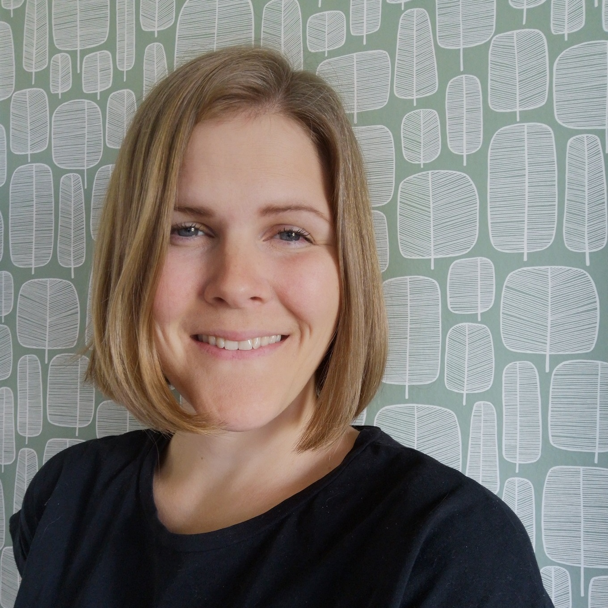

I am a PhD candidate at the Department of Sociology, Demography Unit, Stockholm University. I work with computational methods and approaches with Nordic population register data to study topics related to inequality, segregation, and life-course trajectories. I hold a MSc in Computational Social Science from The Institute for Analytical Sociology at Linköping University, as well as both a bachelor’s degree and work experience in the field of social welfare.

In my dissertation I leverage Finnish and Swedish population registers and machine learning methods, to understand complexities in the human life course. I study the predictability of life course trajectories and life outcomes, as well as intergenerational processes, such as SES transmission. This work is done in affiliation with the project Understanding society through register-based machine learning at Linköping University with Maria Brandén, and the 1987 Finnish Birth Cohort study at The Finnish Institute for Health and Welfare. 

I am also affiliated with the Institute of Environmental Medicine at Karolinska Institute, where I work as a part of the group The New World of Work, with Theo Bodin.

Contact:
firstname.lastname @ sociology.su.se
https://www.linkedin.com/in/sanni-kuikka/
https://bsky.app/profile/sunnyx9.bsky.social
